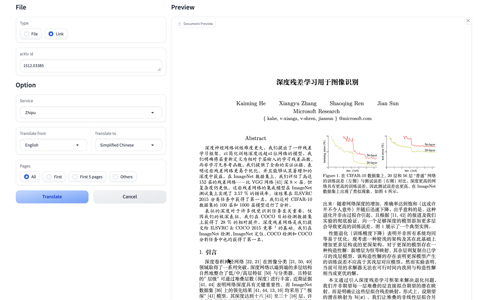
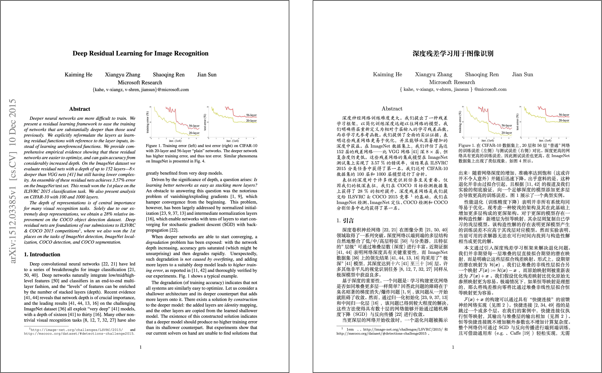

<div align="center">


<h2 id="title">TranslaTex</h2>

</div>

<p align="center">
支持 LaTeX 文件与 arXiv TeX 源码的一键翻译，集成多种翻译引擎（机器翻译与AI大模型），支持多语言、多API（后续开发）
</p>

---

<h2 id="功能亮点">✨ 功能亮点</h2>

- 📝 支持翻译 `.tex` 文件与 arXiv 论文源码
- 🔍 自动识别并保留原始结构：章节标题、公式、引用文献等
- 🖥️ 提供简洁直观的图形界面（基于 Gradio 实现）
- 🌐 支持多种翻译模式：机器翻译、AI 大模型翻译，可灵活切换


---

<h2 id="Gui">🖼️ 图形界面</h2>

<div align="center">

</div>


---

<h2 id="preview">📌 预览效果</h2>

<div align="center">

</div>

---


## 🚀 快速开始

### 1. 克隆项目

```bash
git clone https://github.com/your-username/TranslaTex.git
cd TranslaTex
```

### 2. 安装latex
```bash
xelatex --version
bibtex --version
```

### 3. 启动图形界面

```bash
python app.py
```

📧 [choucisan@gmail.com]


